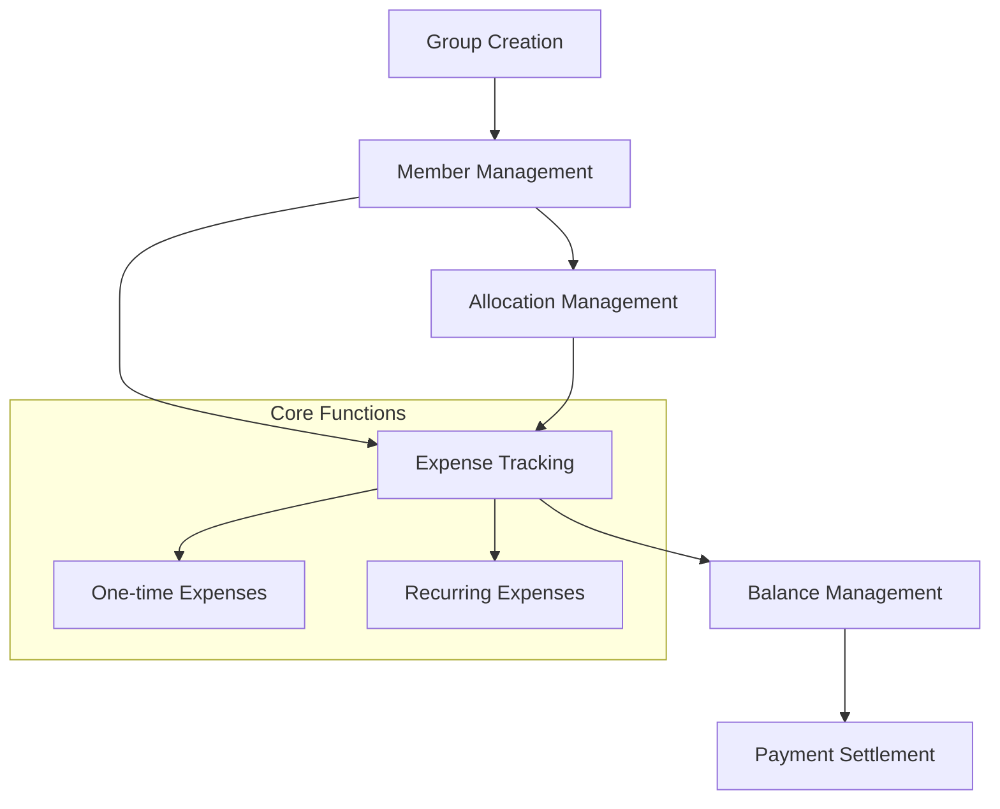

# Era Forward: Collaborative Financial Management

Era Forward is a decentralized Clarity-powered platform that enables transparent and efficient shared financial commitments. It creates a trustless system for tracking group expenses, allocating costs, and managing settlements without requiring centralized control.

## Overview

Era Forward empowers groups to:
- Create shared financial groups
- Set up and track recurring expenses
- Add one-time collaborative expenses
- Manage custom expense allocations
- Track real-time financial balances
- Settle payments transparently
- Record and verify external transactions

## Architecture

The system centers on a core smart contract managing group finances, expenses, and settlements:



### Core Components:
- **Financial Groups**: Base unit for collaborative spending
- **Members**: Participants in a financial group
- **Expenses**: One-time and recurring financial obligations
- **Balances**: Real-time financial tracking
- **Settlements**: Transaction and payment resolution

## Contract Documentation

### Era Forward Manager Contract (`era-forward-manager.clar`)

The primary contract handling financial group management and transaction operations.

#### Key Features:
- Financial group creation and management
- Member participation and allocation
- Comprehensive expense tracking
- Dynamic expense allocation
- Precise balance tracking
- Transparent payment settlement

#### Access Control:
- Group creators have administrative privileges
- Members can contribute and settle expenses
- Admins manage membership and allocations

## Getting Started

### Prerequisites
- Clarinet development environment
- Stacks wallet for deployment

### Basic Usage

1. Create a financial group:
```clarity
(contract-call? .era-forward-manager create-household "Tech Startup Co-Founders")
```

2. Add members:
```clarity
(contract-call? .era-forward-manager add-member group-id member-address)
```

3. Add an expense:
```clarity
(contract-call? .era-forward-manager add-one-time-expense group-id "Conference Tickets" u500 "custom")
```

## Function Reference

### Group Management

```clarity
(create-household (name (string-ascii 100)))
(add-member (group-id uint) (new-member principal))
(update-member-allocation (group-id uint) (member principal) (allocation-bps uint))
```

### Expense Management

```clarity
(add-one-time-expense (group-id uint) (name (string-ascii 100)) (amount uint) (allocation-type (string-ascii 10)))
(add-recurring-expense (group-id uint) (name (string-ascii 100)) (amount uint) (recurrence-period uint) (allocation-type (string-ascii 10)))
```

### Payment Settlement

```clarity
(settle-payment (group-id uint) (to-member principal) (amount uint))
```

## Development

### Testing
1. Clone the repository
2. Install dependencies: `clarinet install`
3. Run tests: `clarinet test`

### Local Development
1. Start local chain: `clarinet console`
2. Deploy contracts: `clarinet deploy`

## Security Considerations

### Limitations
- Maximum 20 members per financial group
- Positive integer expense amounts
- Custom allocations must total 100%

### Best Practices
- Verify member balances before changes
- Validate expense allocations
- Confirm payment amounts
- Promptly record external transactions

Robust validation ensures:
- Membership authorization
- Expense allocation accuracy
- Balanced settlements
- Proper group administration